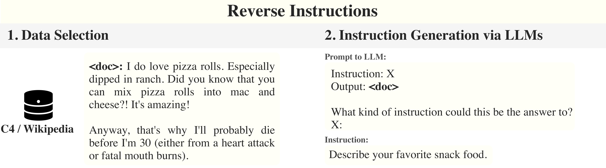

# LongForm: Effective Instruction Tuning with Reverse Instructions
The LongForm dataset is created by leveraging English corpus examples with the **reverse instructions** method. We select a diverse set of human-written documents from existing corpora such as C4 and Wikipedia and generate instructions for the given documents via LLMs. Then, we extend these examples with structured corpora examples such as Stack Exchange and WikiHow and task examples such as question answering, email writing, grammar error correction, story/poem generation, and text summarization.



## The Dataset and Models
We release _the LongForm-C dataset_ on [Github](https://github.com/akoksal/LongForm/tree/main/dataset) and on [HuggingFace](https://huggingface.co/datasets/akoksal/LongForm). Check out the paper or these links for more detail.

_The LongForm Models_:
We release the models on the model hub of HuggingFace. We cannot release LongForm-LLaMA-7B publicly due to restrictions of LLaMA models.
- LongForm-**LLaMA-7B**-diff*: https://huggingface.co/akoksal/LongForm-LLaMA-7B-diff
- LongForm-**T5-XL**: https://huggingface.co/akoksal/LongForm-T5-XL
- LongForm-**OPT-125M**: https://huggingface.co/akoksal/LongForm-OPT-125M
- LongForm-**OPT-350M**: https://huggingface.co/akoksal/LongForm-OPT-350M
- LongForm-**OPT-1.3B**: https://huggingface.co/akoksal/LongForm-OPT-1.3B
- LongForm-**OPT-2.7B**: https://huggingface.co/akoksal/LongForm-OPT-2.7B
- LongForm-**OPT-6.7B**: https://huggingface.co/akoksal/LongForm-OPT-6.7B

*You need to have the original weights of LLaMA-7B and add with this diff to get the LongForm model. 

## Evaluation
We provide in-depth evaluation of LongForm models and baselines in the paper. We present the METEOR scores of models in out-of-domain datasets. In all tasks, Recipe Generation (RGen), long-form question answering (ELI5), short story generation (WritingPrompts/WP), LongForm models outperform prior instruction-tuned models.
|          | **All** | **Recipe Generation**             | **ELI5** | **Writing Prompts** |
|-----------------------|---------|-----------------------------------|----------|---------------------|
| **T0++**              | 10.9    | 18.7                              | 3.8      | 10.2                |
| **Tk-Instruct**       | 6.3     | 12.9* | 3.6      | 2.4                 |
| **Flan-T5**           | 10.6    | 20.9* | 3.5      | 7.4                 |
| **Alpaca-LLaMA-7B**   | 14.6    | 19.5                              | 12.5     | 11.8                |
| **OPT-30B**           | 11.1    | 18.6                              | 12.2     | 2.6                 |
| **[LongForm-T5-XL](https://huggingface.co/akoksal/LongForm-T5-XL)**    | 16.3    | 20.2                              | 18.3     | 10.6                |
| **[LongForm-OPT-6.7B](https://huggingface.co/akoksal/LongForm-OPT-6.7B)** | 17.7    | 16.9                              | 17.2     | 19.0                |
| [**LongForm-LLaMA-7B**](https://huggingface.co/akoksal/LongForm-LLaMA-7B-diff)‡ | **19.7**    | **21.7**                              | **18.6**     | 18.9                |

### Language Understanding and Generation
We compare the performance of the LongForm-C dataset, the FLAN dataset, and a combined model finetuned with both datasets on both NLG and NLU tasks, aiming to evaluate LongForm-C's effectiveness in improving NLU alongside generation tasks.
| **Model** | **Dataset**     | **NLG**  | **NLU (5-shot MMLU)** |
| --------- | --------------- | -------- | --------------------- |
| LLaMA-7B  | FLAN            | 9.1      | 36.6                  |
| LLaMA-7B  | LongForm-C      | **19.7** | 35.2                  |
| LLaMA-7B  | FLAN+LongForm-C | 16.5     | **38.9**              |

Smaller versions of LongForm-OPT models are also available:
- [**LongForm-OPT-2.7B**](https://huggingface.co/akoksal/LongForm-OPT-2.7B)
- [**LongForm-OPT-1.3B**](https://huggingface.co/akoksal/LongForm-OPT-1.3B)
- [**LongForm-OPT-350M**](https://huggingface.co/akoksal/LongForm-OPT-350M)
- [**LongForm-OPT-125M**](https://huggingface.co/akoksal/LongForm-OPT-125M)

‡: We can just release the difference between LongForm-LLaMA-7B and pretrained LLaMA-7B publicly due to restrictions of LLaMA models.

## Limitations
The LongForm dataset and models mainly focus on long text generation and have limitations regarding structured prediction tasks in NLP. Additionally, we observe that LongForm models may present hallucination problems similar to those found in LLMs.

## License
The LongForm project is subject to a MIT License with custom limitations for restrictions imposed by OpenAI (for the instruction generation part), as well as the license of language models (OPT, LLaMA, and T5). The WikiHow subset of LongForm-C is subject to the license proposed by WikiHow.

## Citation
```
@misc{koksal2023longform,
      title={LongForm: Effective Instruction Tuning with Reverse Instructions}, 
      author={Abdullatif Köksal and Timo Schick and Anna Korhonen and Hinrich Schütze},
      year={2023},
      eprint={2304.08460},
      archivePrefix={arXiv},
      primaryClass={cs.CL}
}
```
